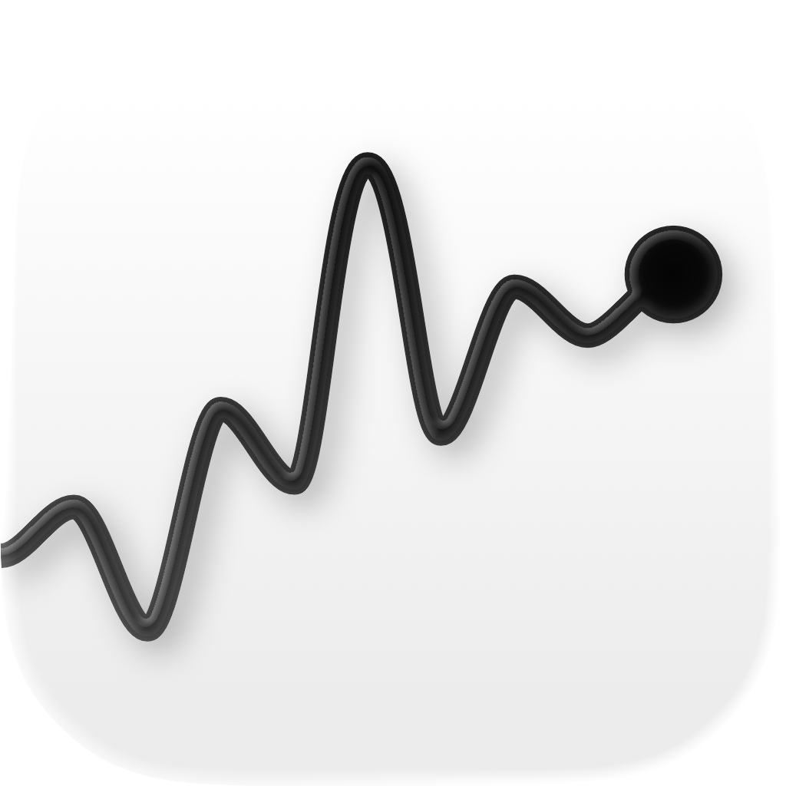
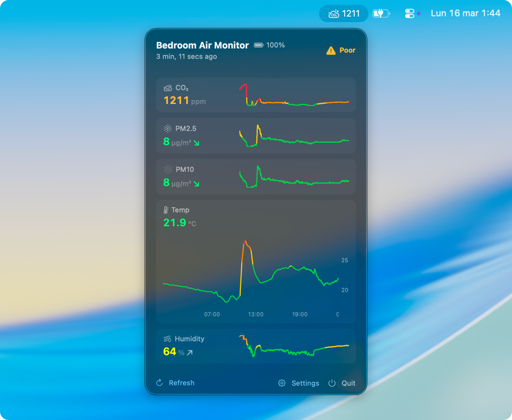

#  Qingping Menu Bar

A lightweight macOS menu bar app for monitoring your **Qingping Air Monitor Lite** (CGDN1) in real time.



## What it does

- Shows your current CO₂, PM2.5, PM10, temperature, humidity, and battery level in a clean popover
- Displays the selected metric (CO₂ by default) directly in your menu bar for at-a-glance monitoring
- Smooth sparkline charts for every metric, color-coded by air quality thresholds
- Tap any metric to expand an interactive chart with hover cursor showing exact values and timestamps
- Trend arrows show whether each metric is rising or falling
- Relative timestamps ("3 min ago") with stale data and device offline warnings
- °C / °F temperature unit toggle
- Launch at login support

## Data sources

The app supports two ways to get data from your device:

### Bluetooth (default)

Reads sensor data directly from BLE advertisements — **no cloud, no credentials, no internet needed**. Just launch the app near your device and it works. Updates every 5–10 seconds. History is built from live readings and persisted to disk.

### Cloud API (optional)

Polls the Qingping cloud API every 60 seconds. Requires free API credentials from [developer.qingping.co](https://developer.qingping.co/personal/permissionApply). Useful if your device is out of Bluetooth range. The API can be slow or unreliable depending on region.

You can switch between data sources in **Settings > Data Source**.

## Color thresholds

The sparkline charts, values, and trend arrows change color based on indoor air quality guidelines:

| Metric | Good (green) | Moderate (amber) | Poor (orange) | Very Poor (red) |
|--------|-------------|-------------------|---------------|-----------------|
| CO₂ | < 800 ppm | 800–1000 | 1000–1500 | > 1500 |
| PM2.5 | < 12 µg/m³ | 12–35 | 35–55 | > 55 |
| PM10 | < 54 µg/m³ | 54–154 | 154–254 | > 254 |
| Temperature | 18–24°C | 16–26°C | 14–28°C | Outside range |
| Humidity | 30–60% | 20–70% | Outside range | — |

The overall quality badge in the header shows the worst level across all metrics.

## Requirements

- macOS 26 (Tahoe) or later
- A [Qingping Air Monitor Lite](https://www.qingping.co/air-monitor-lite/overview) (model CGDN1)
- The device must be set up via the **Qingping+** app first (either Qingping mode or HomeKit mode — BLE works with both)

## Setup

### Bluetooth (recommended)

1. Set up your device with the **Qingping+** app ([iOS](https://apps.apple.com/app/qingping/id1344636968) / [Android](https://play.google.com/store/apps/details?id=com.cleargrass.app.air))
2. Install and launch QingpingMenuBar
3. Grant Bluetooth permission when prompted

That's it — the app will automatically detect your device and start showing data.

### Cloud API (optional)

If you need Cloud API mode (device out of BLE range):

1. Make sure the device is connected to WiFi and set to **Qingping mode** (not HomeKit) in the Qingping+ app
2. Go to [developer.qingping.co](https://developer.qingping.co/personal/permissionApply) and get your **App Key** and **App Secret**
3. In the app, go to **Settings > Data Source > Cloud API**
4. Enter your credentials and click **Save**

### Install

**Option A: Download the release**

Download the latest `.dmg` from the [Releases](../../releases) page. Open it, drag the app to your Applications folder, and launch it.

**Option B: Build from source**

```bash
git clone https://github.com/andreugordillovazquez/QingpingMenuBar.git
cd QingpingMenuBar
open QingpingMenuBar.xcodeproj
```

Build and run from Xcode (requires Xcode 26+).

## Settings

Click the Settings button in the popover footer to access:

- **Data Source** — switch between Bluetooth and Cloud API
- **API Credentials** — your Qingping App Key and Secret (Cloud API mode only)
- **Menu Bar Metric** — choose which metric to display in the menu bar
- **Temperature Unit** — switch between °C and °F
- **Launch at login** — start the app automatically when you log in

## Privacy & security

- **BLE mode**: all data stays on your Mac — no network calls, no cloud
- **Cloud API mode**: credentials are stored in the macOS Keychain, scoped to this app's sandbox. All communication is over HTTPS
- No telemetry, analytics, or data collection
- App Sandbox and Hardened Runtime are enabled
- BLE data is unencrypted broadcast — any nearby device can read it (this is how the Qingping protocol works)

## Tech stack

- SwiftUI with `MenuBarExtra` (`.window` style)
- CoreBluetooth for passive BLE advertisement scanning
- Swift Charts for sparklines and interactive expanded charts
- Swift concurrency (`async/await`, actors)
- `@Observable` (Observation framework)
- macOS Keychain for credential storage
- Qingping Cloud API (OAuth2 + REST)

## License

MIT

## Disclaimer

This project is not affiliated with, endorsed by, or sponsored by Qingping or Cleargrass. "Qingping" is a trademark of Beijing Qingping Technology Co., Ltd. This app uses the publicly available Qingping Developer API and reads publicly broadcast BLE advertisements.

## Acknowledgments

- [Qingping](https://www.qingping.co/) for making affordable, hackable air quality monitors with an open API
- [qingping-ble](https://github.com/Bluetooth-Devices/qingping-ble) for documenting the BLE advertisement format
